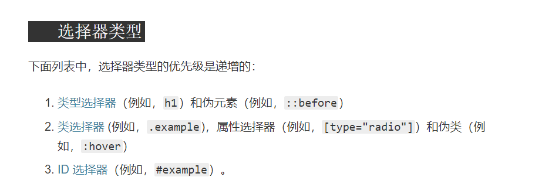

## 腾讯篇

## 腾讯一面

> 整体下来，除了那俩滚动比较恶心其他还好。

### 1.导航栏列表内容不固定，如何平摊

我答的flex布局，或者手动计算每个栏目的宽度而后进行平摊。

### 2.导航栏滚动吸附在页面上方，如何实现，高度如何计算？

sticky布局可以实现，另外获取高度的话如下(没考虑scroll的性能优化，需要的自己用节流或者rAf优化一下)

```
<!DOCTYPE html>
<html lang="en">
  <head>
    <meta charset="UTF-8" />
    <meta name="viewport" content="width=device-width, initial-scale=1.0" />
    <title>Document</title>
  </head>
  <body>
    <div class="nav">
      <div class="div">1</div>
      <div class="div">2</div>
      <div class="div">3</div>
      <div class="div">4</div>
    </div>
    <div>
      Lorem ipsum dolor sit amet consectetur adipisicing elit. Alias excepturi
      est maiores perspiciatis facere similique quos ipsa odio voluptatem,
      cumque fugiat culpa officiis nobis deserunt nam, laborum error dolorem
      voluptates.
    </div>
  </body>
</html>

<script>
  let node = document.getElementsByClassName("nav")[0];

  document.addEventListener("scroll", () => {
    console.log(window.scrollY);
    if (window.scrollY > 50) {
      node.classList.add("fixnav");
    };
    if (window.scrollY <= 50) {
      node.classList.remove("fixnav");
    }
  });
</script>

<style>
  body {
    height: 2000px;
  }
  .nav {
    display: flex;
    flex-direction: row;
    height: 50px;
    width: 100%;
  }
  .div {
    width: 50px;
    height: 50px;
    background-color: brown;
  }
  .fixnav {
    position: fixed;
    top: 0px;
  }
</style>
```

### 3.前端性能优化

### 4.let.const.var

### 5.常见的排序算法，快排的思路

### 6.一万个阶梯，每次可以走一步，两步，三步，总共有几种走法。

递归，出口是a\[n\] = a\[n-1\] + a\[n-2\] + a\[n-3\]，类似于斐波那契数列。可以用记忆化数组之类的进行优化。

### 7.网络的七层(五层)协议，TCP,UDP,HTTP,BGP,ICMP等等

(没讲协议具体内容，只讲名字)。

### 8.子网掩码的计算

### 9.一万个节点怎么渲染会不卡

### 10.一万个节点每个节点固定高度，获取当前视口的第一个节点是一万个节点中的哪一个。

又问回到那个scrollY上面去了

### 11.for/const/var的代码规范问题

### 12.const定义的对象中的值是否可以改变

对象中的值是可以的，不可改变的只是对象本身的引用。

### 13.类选择器，伪类选择器，元素(类型)选择器，伪元素选择器的优先级。

MDN:



### 14.纯CSS实现奇偶项背景颜色的不同

```
p:nth-child(odd){} //奇数行

p:nth-child(even){} //偶数行
```

### 15.百度的URL的用js拿到query的部分

### 16.history和hash的区别

### 17.Vue子组件父组件的消息传递

### 18.父组件能调用子组件的方法吗？

this.$refs

### 19.父子组件的生命周期的变化

### 20.有没有了解过SSR?

### 21.从远古时代的JSP到现在又经历了服务端的模板渲染，为什么会这样发展?

同构

### 22.问了项目，项目哪些部分能复用等等，项目聊的比较杂。

### 23.js和css在html的放置位置。

## 腾讯二面

> webpack哟webpack，简历上写着"了解WebPack对项⽬打包的过程及原理"，知道这什么概念吧...

### 1.服创比赛我在组内司何职，有什么出彩的点。

### 2.服创文件夹的构成

组件一个文件夹，工具类抽出来自成一个文件夹，UI，静态资源等等自成一个文件夹

### 3.为什么选IOS开发

### 4.APP骨架怎么设计的

根据需求抽象出三大块骨架(翻译，我的，推荐)

### 5.登录模块写了吗?有考虑过安全吗?

因为比赛重心放在翻译等功能上，登录没有做商业化的封装，只是简单的数据库查询。但是如果需要可以上https等。

### 6.你说到HTTPS，说说他怎么保证安全的?

说一下https相关握手即可

### 7.有抓过HTTPS的包吗?

### 8.说说一些安全问题吧。

web的安全无非就是xss,csrf,sql注入,站点提权等等

### 9.说说XSS

### 10.怎么防XSS呢?

做转义，这一块答歇逼了没答好

### 11.你做第二个项目的时候咋跨域?哪里配置?

node本地的Proxy，配置的话在vue.config.js，实际上还是webpack的配置文件

### 12.你刚刚说的那个反代映射到webpack中的哪里？

布吉岛（`devServer`）

### 13.webpack的loader是啥?

我说是分析依赖后调用的东西，举了俩例子一个babel-loader一个sass-loader有啥用，ast语法树之类的，面试官最后说了三个字"加载器"，言简意赅。

### 14.vue的router用过吗?底层原生调用的方法是啥?

history是pushstate等等，hash的话是location.hash等等

### 15.懒路由咋实现。

我说了import函数

### 16.为啥懒路由好?

我只聊了表层的，我估计面试官其实想我说说webpackchunk之类的

### 17.咋用原生的方法插HTML?

createElement，insertBefore，innerHTML

### 18.Vuex的数据流说一说

### 19.你项目里面的vuex就管理登录状态的吗?(面试官一脸惊讶-。-)

### 20.你觉得哪些变量放vuex里会好一点。

### 21.为啥vuex是单向数据流的?

### 22.说一说vue全家桶吧(不要依赖全家桶)

### 23.用vue多久了

### 24.有没有系统的学习过CSS呀

### 25.CSS里面有一个很重要的概念叫做BFC，那是啥玩意儿?

### 26.咋触发BFC?BFC有啥用?

### 27.浮动元素导致父节点的高度坍塌是为啥。

我说浮动元素有点像z-index的意味但又不是z-index，也有点像脱离文档流的意思导致父元素没有内容撑开他的高度了

### 28.position都有哪些？

### 29.你说到了sticky那是啥玩意儿

### 30.ES6中的Proxy了解过吗?

莫得，还在看(嘛~实际上就是代理对象加各种trap)

### 31.了解promise.all/race/finally吗

PS:建议自己看看他们的源码并且手写一遍

### 32.说一说Flex布局

### 33.你当时做服创的时候怎么做版本管理的?

如实回答，没用Git，每天手动merge，剽悍霸气。(面试官说这个是我的问题，要背锅)

### 34.服创的项目有什么优化

### 35.Vue的生命周期

### 35.vue中一些数组做push操作的时候页面上能看得到吗?

我说push是可以的因为作者特别的数组的一些方法进行了hack但是改变数组下标就不可以了。

### 36.那为啥改变数组下标监听不到呢?

布吉岛啊，我说defineproperty本身是可以监听的到的但是vue作者处于性能考虑把这部分内容砍掉了，面试不是很满意，他说这个跟js最基础的基本类型有关，于是他就问我接下来这个题。

### 37.js基本类型有哪些，Object是啥类型?

### 38.vue中的key了解过吗，有啥用?

我说涉及到底层的diff算法的patch过程，做标识。或者做状态更新，我还补充了说这个是底层的一些作用，我一般自己也会用key做一些业务逻辑上的标识。

### 39.你说到了diff算法，讲一讲?

我说那玩意儿太复杂了只知道个大概，头头尾尾尾头尾尾作比较，如果不用key的话就要遍历，时间复杂度会很高，我还讲了也不是一定要加key速度就越快，因为vue本身是原地复用的所以你加key就唯一了不能复用了，在一些特殊情况比如每个节点没有自己的业务状态的时候这样加key反而会变慢。

### 40.(在上面生命周期之后问的)有一些异步的请求你放在mounted()里头能不能拿到?

我说了一个我之前视频网校的一个bug，就是我在mounted里头进行一个异步的axios但是拿不到视频的url，所以我尝试把这部分操作直接拉到created()钩子里头去。

### 41.讲一讲你们vue项目的架构

前端vue，后端SSM，还有一个后台管理系统(我没讲这个东西是ssh的怕他问你为啥同一个数据库要两个持久层)

### 42.前后端分离吗，怎么做接口的，有文档吗?

### 43.有用过slot吗?是模板的还是指令的?

用过的，我自己写的那个延迟组件就是一个基于模板的插槽

### 44.有什么想问我的?

## 字节篇

> 宇宙条果然是宇宙条，难度和广度跟别的厂都不是一个量级的，何苦为难我一个实习生呐~

## 字节一面(58min)

> 面试官给的评价是前面答得都挺好，最后代码编写的不尽人意，哇靠我刷了那么多leetcode就出了一道算法题，另外一些手撕都是工程题，难受啊~~

### 1.怎么从客户端开发转前端的

### 2.如何学习前端

### 3.实现一个三栏布局，左边100px，中间自适应，右边20%

> 手撕，很久没写布局了当时就写了下面这个圣杯，右边可能有点问题，但大概就是这个样子

```
<!DOCTYPE html>
<html lang="en">
<head>
    <meta charset="UTF-8">
    <meta name="viewport" content="width=device-width, initial-scale=1.0">
    <title>Document</title>
</head>
<body>
    <div class='container'>
        <div class="main"></div>
        <div class="left"></div>
        <div class="right"></div>
    </div>
</body>
</html>

<style>
    *{
        margin:0 ;
    }
    .container{
        margin-left: 100px;
        margin-right: 20%;
    }
    .main{
        width: 100%;
        height: 500px;
        float: left;
        position: relative;
        background-color: blue;

    }
    .left{
        width: 100px;
        height: 500px;
        background-color: blueviolet;
        float: left;
        position: relative;
        margin-left: -100%;
        left: -100px;
    }
    .right{
        width: 20%;
        height: 500px;
        background-color: burlywood;
        float: right;
        position: relative;
        margin-left: -20%;
        left: 20%;
    }
</style>
```

### 4.三栏布局和圣杯布局的区别

### 5.做道题吧！

```
var obj = {m:1}
    var test = (k)=>{
        k = {n:2}
    }
    test(obj)
    console.log(obj)
//{m:1}  作用域问题
```

### 6.跨域遇到过吗？解决办法？

### 7.你说到了jsonp，详细说说？

### 8.你说到了CORS，后台怎么设置有了解吗？

> 我说后台设置header头里面的ACAO为\*即可

### 9.ACAO为\*不会有安全问题吗？那不为\*维护一个白名单有没有域名上线呢？

### 10.你说ACAO为\*但是ACAC为true的情况下浏览器默认会拦截cookie，那我一定要发cookie怎么办？

### 11.script标签中async和defer的区别

### 12.iphonex的兼容性问题

> 这部分我想到了以前IOS开发的时候的safe-area，但是当时并不知道webkit中有safe-area的函数，这里贴一个解决方案
> 
> [https://aotu.io/notes/2017/11/27/iphonex/index.html](https://aotu.io/notes/2017/11/27/iphonex/index.html)

### 13.Vue中的computed和watch的区别

### 14.Vue中如何去实现一个类似于react的 fragment

> 这题我人傻了，真的，有那么一刻我怀疑面试官是不是故意刁难我(PS:Vue3中有开箱即用的解决方案)

### 15.讲讲Vuex

### 16.es5实现一个const

> 我说用 defineProperty 把writable给设置为false，或者用一些Object.freeze之类的API

### 17.nomodule，type:'module'能详细讲讲吗

### 18.webpack了解吗，有自己去起一个工程吗？

### 19\. module ， plugin ， resolve ， entry ， output 都是啥能解释一下吗？

### 20.你说到了 tree sharking   ，能讲一下他在哪配置的吗？

> 这个我真不会。(实际上把mode改为production webpack就自动会进行tree-shaking)

### 21.手撕一个订阅发布者模式

(见我的其他博文)

### 22.手撕一个bind函数

## 京东篇

> 部门是新零售下面的一个前端部门，算偏核心，不过不知道为什么这次京东的题目为什么偏简单。

## 京东一面(20min)

### 1.js变量的类型

### 2.const和let的区别

### 3.const一个对象，能更改对象中的值吗？

### 4.跨域

### 5.promise在项目中用过吗？

### 6.未来有想转全栈吗？

> 其他的我不记得了，应该还有一部分，总的来说问的问题偏简单。面试官说不要给校招生出难题毕竟他们还没经历过社会的毒打😄

## 京东二面(20min)

### 1.怎么就客户端转前端了？

### 2.说说跨域

### 3.你刚刚说codepen这些东西都是偏视觉的，了解底层吗?

### 4.平时都用什么APP

> 我直接把我手机拿起来挑了几个优质APP了，微信QQ虎扑B站掘金京东淘宝夸克等等。。

### 5.你觉得他们的盈利点在哪？

### 6.如果是你，你觉的当下五一假期如何寻找盈利模式

### 7.那些很花里胡哨的技术如何落地服务于老百姓呢？

### 8.一面的面试官说你会转全栈，说说看？

> 我说一定会往大前端的方向迈进的，这个是各种原因的趋势必然。

### 9.你说说看对大前端的看法？

> 问到这里你也发现了出了问了一个技术的跨域问题其他都是产品的问题，我有点怀疑这个面试官是团队中的产品经理之类的，技术出身的那种，所以我反问了一句咋一直不问技术哈哈，结果他回答的我觉得也很好，"技术最终还是要服务于产品，如果一个做开发的不知道这个产品的整个模式那么他是没有方向的"，随后我一顿表示无比赞同。

### 10.反问环节:侧重于实习生的哪些品质，以及如何培养实习生？

## 京东HR面

### 1.用两个词形容自己

### 2.怎么去平衡每天枯燥的代码生活

### 3.喜欢一个什么样的工作氛围

### 4.在家还是在学校

### 5.同学们怎么看待自己
