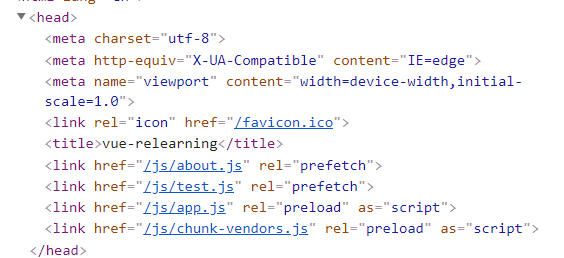
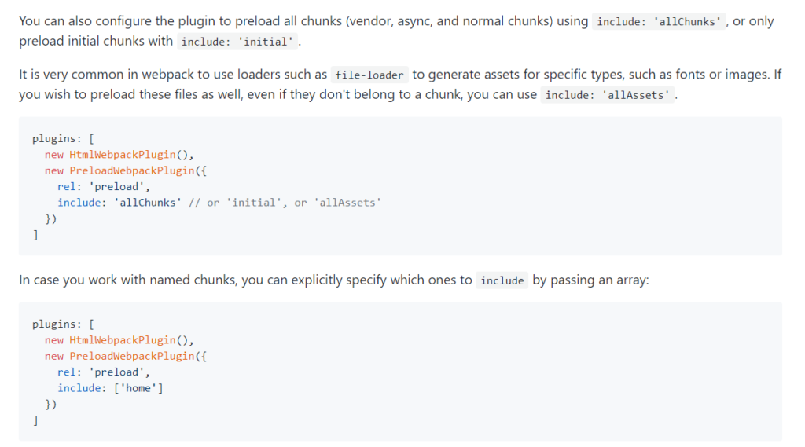
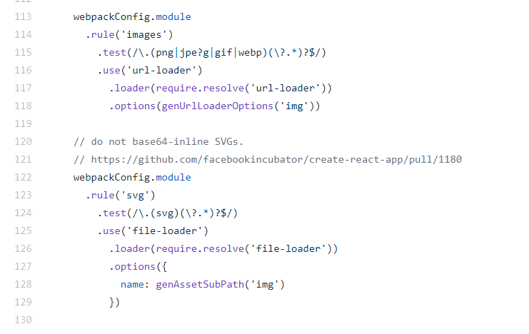
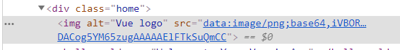
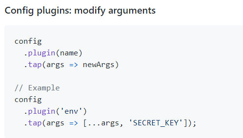
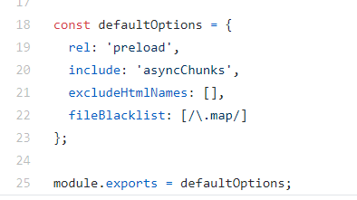
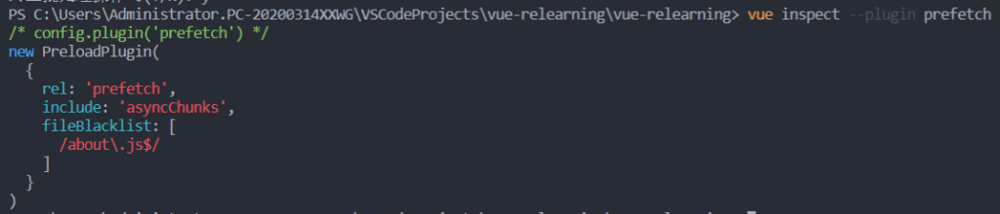

> 原创不易，转载请注明本网站。

## HTML和静态资源

### Preload/Prefetch



上述图片描述的是我用CLI默认起的SPA应用的head头部的相关内容，可以清楚的发现app.js和chunk.js加上了 **_rel='preload'_** 的属性， 默认情况下，一个 Vue CLI 应用会为所有初始化渲染需要的文件自动生成 preload 提示。 而about.js和test.js则加上了 **_rel='prefetch'_** 的属性 ， 默认情况下，一个 Vue CLI 应用会为所有作为 async chunk 生成的 JavaScript 文件(import函数分块懒路由之类的)自动添加该属性。

那preload和prefetch有什么作用呢？

这里我摘抄一段preload-webpack-plugin里对二者的描述。

> [Preload](https://w3c.github.io/preload/) is a web standard aimed at improving performance and granular loading of resources. It is a declarative fetch that can tell a browser to start fetching a source because a developer knows the resource will be needed soon. [Preload: What is it good for?](https://www.smashingmagazine.com/2016/02/preload-what-is-it-good-for/) is a recommended read if you haven't used the feature before.In simple web apps, it's straight-forward to specify static paths to scripts you would like to preload - especially if their names or locations are unlikely to change. In more complex apps, JavaScript can be split into "chunks" (that represent routes or components) at with dynamic names. These names can include hashes, numbers and other properties that can change with each build.
> 
> [https://github.com/GoogleChromeLabs/preload-webpack-plugin](https://github.com/GoogleChromeLabs/preload-webpack-plugin)

这里我在贴一个国内的我认为不错的介绍帖子: [https://blog.fundebug.com/2019/04/11/understand-preload-and-prefetch/](https://blog.fundebug.com/2019/04/11/understand-preload-and-prefetch/)

官方的webpack设置选项由下：(vue.config.js)(SPA)

```
module.exports = {
  devServer: {},
  chainWebpack: (config) => {
    config.plugins.delete("prefetch");
    config.plugins.delete("preload");
  },
};
```

这样一来就可以屏蔽prefetch和preload了。查看vue-cli的源码可知，这里我粘贴一部分源码。(packages/@vue/cli-service/lib/config/app.js)

```
webpackConfig
        .plugin('html')
          .use(HTMLPlugin, [htmlOptions])

      if (!isLegacyBundle) {
        // inject preload/prefetch to HTML
        webpackConfig
          .plugin('preload')
            .use(PreloadPlugin, [{
              rel: 'preload',
              include: 'initial',
              fileBlacklist: [/\.map$/, /hot-update\.js$/]
            }])

        webpackConfig
          .plugin('prefetch')
            .use(PreloadPlugin, [{
              rel: 'prefetch',
              include: 'asyncChunks'
            }])
      }
```

分析可知其仍然是调用谷歌的preload-webpack-plugin，[Github](https://github.com/GoogleChromeLabs/preload-webpack-plugin)。那么所有API都是通用的。

其中几个字段:

- `rel`，没得说。preload和prefetch二选一
- `include`  ，由vue-cli源码可知，脚手架会默认让‘initial’部分为preload，而那些懒加载的chunks则是prefetch，对应的字段便是‘asyncChunks’。那么这里还能填什么呢？查看谷歌官网得知，这里还能填'allChunks' ，'allAssets'，甚至直接传入一个具名的数组，写入chunk的name做针对性的hint。具体的见 preload-webpack-plugin 的 [Github](https://github.com/GoogleChromeLabs/preload-webpack-plugin) 。
- `fileBlacklist`  ，字如其名，黑名单，有一些文件比如 sourcemaps 是完全没必要预加载的，所以直接写到黑名单里去就好了。如上，cli默认有这么一条规则，fileBlacklist: \[/.map$/, /hot-update.js$/\]。



preload-webpack-plugin

> 但是不是所有东西都上预加载的，有一些虽然预加载了但是并没有使用的就成了浪费带宽的累赘，特别是在带宽敏感的移动端特别突出。这里就要手动去针对配置这些hint的选项了。

### 处理静态资源

在cli起的工程中，public目录下的文件或者绝对路径引用的资源是不会被webpack打包的(直接拷贝)。而那些用相对路径引用的静态资源则会被webpack打包(当作一个模块)。(被翻译成require)

另外，vue内部采用file-loader做文件的hash对比，用url-loader对小于4k的图片等资源做内联以减少http的请求量。详情可见[源码](https://github.com/vuejs/vue-cli/tree/dev/packages/%40vue/cli-service/lib/config/base.js)如下:**（packages/@vue/cli-service/lib/config/base.js）**PS:这个base.js很有意思，里面包含了vue默认的所有loader和plugins，推荐自己仔细的去看看这个源码。



下面给出一个常见的url-loader的webpack配置和vue官网给出的chainWebpack版本的配置。

```
//自己写的传统版本，有bug，图片显示不出来，暂时埋坑
configureWebpack: {
    module: {
      rules: [
        {
          test: /\.(png|jpe?g|gif|webp)(\?.*)?$/,
          use: [
            {
              loader: "url-loader",
              options: {
                limit: 10240,
              },
            },
          ],
        },
      ],
    },
  },

//官网给的chainWebpack版本
  chainWebpack: (config) => {
    config.module
      .rule("images")
      .use("url-loader")
      .loader("url-loader")
      .tap((options) => Object.assign(options, { limit: 10240 }));
  },
```



可以很清楚的看到图片被内联了。

> 官网中有提到一点就是 如果你想要替换一个已有的[基础 loader](https://github.com/vuejs/vue-cli/tree/dev/packages/%40vue/cli-service/lib/config/base.js) ，请首先清楚对应的基础loader，否则就加上去了。具体的方法如果是chainWebpack的话可以采用如下形式(详见相关[API](https://github.com/neutrinojs/webpack-chain))。config.module.rule('a rule').uses.clear()

## Webpack

Vue官网中对webpack的配置(even the core codes)都是清一色的用[chainWebpack](https://github.com/neutrinojs/webpack-chain)的形式，那么我们就有必要对这个形式有较多的了解。

### 修改插件选项

参考chainWebpack的文档可知。



.tap(options=>\[\])提供了这么一个功能，返回的值便是作为plugins或者其他的构造函数的入参。这里要配合plugins的一些源码来做options的最大能动化，比如说最上面提到的prefetch插件( [preload-webpack-plugin](https://github.com/GoogleChromeLabs/preload-webpack-plugin) )。查看源码可知，他的配置入参无非就那么几个。如下图:(src/lib/[default-options.js](https://github.com/GoogleChromeLabs/preload-webpack-plugin/blob/master/src/lib/default-options.js))



那么配合如上参数我们可以写出下面这一段代码来修改plugin的相关参数(这里我修改黑名单)。

```
config.plugin("prefetch").tap((options) => {
      options[0].fileBlacklist = options[0].fileBlacklist || [];//置空
      options[0].fileBlacklist.push(/test\.js$/);
      return options;
    });
```

接下来使用Vue inspect查看相关参数可见:



可以发现黑名单已经被修改，重启HMR之后发现原来被我懒加载的路由"test"确实没有了prefetch的属性~

> 另外，官网说对于 CSS 相关 loader 来说，推荐使用 [css.loaderOptions](https://cli.vuejs.org/zh/config/#css-loaderoptions) 而不是直接链式指定 loader。这是因为每种 CSS 文件类型都有多个规则，而 `css.loaderOptions` 可以确保你通过一个地方影响所有的规则。
