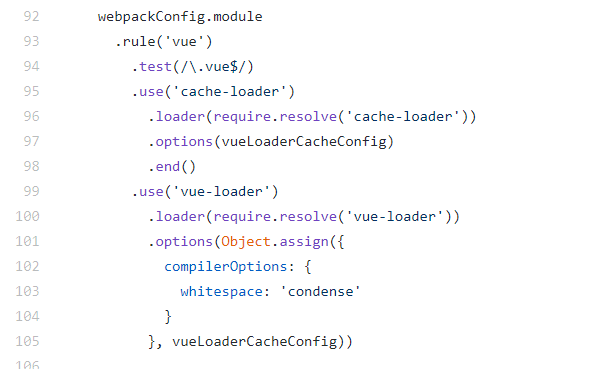
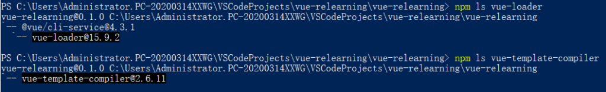
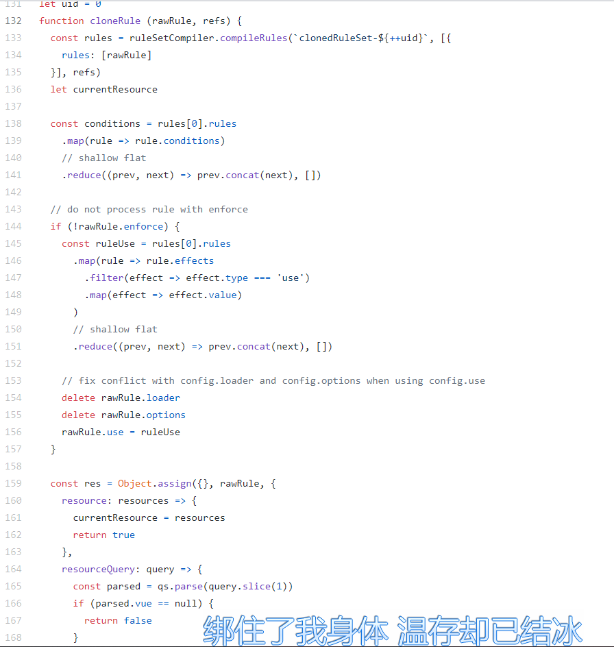
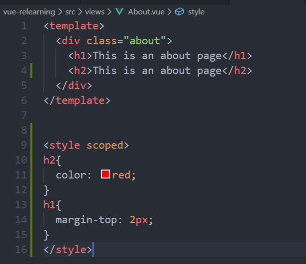
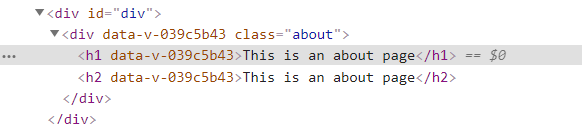
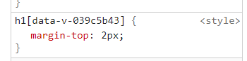

> 原创不易，转载请注明本站。

实际上之前开发vue的SPA时，我们会编写很多各components，每一个component实际上都是一个vue实例，形式上都是以.vue结尾的组件。与React不同，Vue有着自己的一套模板引擎，所以所有vue组件都需要给 **`vue-template-compiler`** 编译成js渲染出来。



如图，这是CLI的默认[loader](https://github.com/vuejs/vue-cli/blob/dev/packages/%40vue/cli-service/lib/config/base.js)，你会发现对于所有的.vue组件，vue内部都会用vue-loader去做解析(在那之前还会用cache-loader做缓存)。

那么自然想到的是CLI已经帮我们集成了vue-loader，如下图。



如果不借助CLI自己手动配的话，webpack可以写成如下形式，之后有时间我也会写一篇不借助CLI纯手工搭建一个Vue的运行环境。

```
// webpack.config.js
const VueLoaderPlugin = require('vue-loader/lib/plugin')

module.exports = {
  mode: 'development',
  module: {
    rules: [
      {
        test: /\.vue$/,
        loader: 'vue-loader'
      },
      // 它会应用到普通的 `.js` 文件
      // 以及 `.vue` 文件中的 `<script>` 块
      {
        test: /\.js$/,
        loader: 'babel-loader'
      },
      // 它会应用到普通的 `.css` 文件
      // 以及 `.vue` 文件中的 `<style>` 块
      {
        test: /\.css$/,
        use: [
          'vue-style-loader',
          'css-loader'
        ]
      }
    ]
  },
  plugins: [
    // 请确保引入这个插件来施展魔法
    new VueLoaderPlugin()
  ]
}
```

值得一提的是上面的一个Plugin，VueLoaderPlugin，官网说一定要引入这个插件确保那些loader的规则能被应用到Vue模板里面去解析相应的<script><style>块。我们简单的做一个溯源。可以发现这个插件的源码相关代码截取如下:（lib/plugin-[webpack5.js](https://github.com/vuejs/vue-loader/blob/master/lib/plugin-webpack5.js)）



可以隐隐约约的发现这几段代码就是使得你的这些loader应用到vue模板里面的代码。具体的运作模式大家可以自行前往解剖。

### Vue-loader的options

#### transformAssetUrls

用法:比如我现在要去是的我自定义的v-img标签的src做图片的解析，那么用下面这段代码就可以完美解决。

```
config.module
  .rule('vue')
  .use('vue-loader')
    .loader('vue-loader')
    .tap(options => {
      return {
        transformAssetUrls: {
          "v-img": 'src'
        }
      });
```

## Scoped CSS

> 我们知道，我们在编写vue组件时，可以加上"scoped"属性做到样式表的私有化，不造成污染。

具体的表现就是vue-loader会为每一个组件生成自己唯一的id，并且给每个css附上id的属性选择器，并且给每个标签附上自己唯一的id。 如下图。







**_So，how it works？_**

这里我贴一个国内大神的[剖析](https://www.shymean.com/article/%E4%BB%8Evue-loader%E6%BA%90%E7%A0%81%E5%88%86%E6%9E%90CSS-Scoped%E7%9A%84%E5%AE%9E%E7%8E%B0)，我认为写的非常不错，我也是按照他的写法来学习的。

这里给出博文中的总结。Thanks to [shymean](https://www.shymean.com/)，学习良多。

回过头来整理一下`vue-loader`的工作流程

- 首先需要在webpack配置中注册`VueLoaderPlugin`
    - 在插件中，会复制当前项目webpack配置中的rules项，当资源路径包含`query.lang`时通过`resourceQuery`匹配相同的rules并执行对应loader时
    - 插入一个公共的loader，并在`pitch`阶段根据`query.type`插入对应的自定义loader
- 准备工作完成后，当加载`*.vue`时会调用`vue-loader`，
    - 一个单页面组件文件会被解析成一个`descriptor`对象，包含`template`、`script`、`styles`等属性对应各个标签，
    - 对于每个标签，会根据标签属性拼接`src?vue&query`引用代码，其中`src`为单页面组件路径，query为一些特性的参数，比较重要的有`lang`、`type`和`scoped`
        - 如果包含`lang`属性，会匹配与该后缀相同的rules并应用对应的loaders
        - 根据`type`执行对应的自定义loader，`template`将执行`templateLoader`、`style`将执行`stylePostLoader`
- 在`templateLoader`中，会通过`vue-template-compiler`将template转换为render函数，在此过程中，
    - 会将传入的`scopeId`追加到每个标签的`segments`上，最后作为vnode的配置属性传递给`createElemenet`方法，
    - 在render函数调用并渲染页面时，会将`scopeId`属性作为原始属性渲染到页面上
- 在`stylePostLoader`中，通过PostCSS解析style标签内容，同时通过`scopedPlugin`为每个选择器追加一个`[scopeId]`的属性选择器

相关源码我整理了一下:

lib/loaders/[pitcher.js](https://github.com/vuejs/vue-loader/blob/master/lib/loaders/pitcher.js)

lib/loaders/[stylePostLoader.js](https://github.com/vuejs/vue-loader/blob/master/lib/loaders/stylePostLoader.js)

lib/loaders/[templateLoader.js](https://github.com/vuejs/vue-loader/blob/master/lib/loaders/templateLoader.js)
